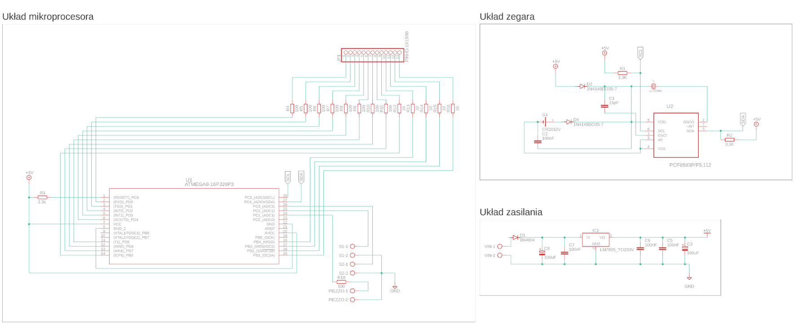
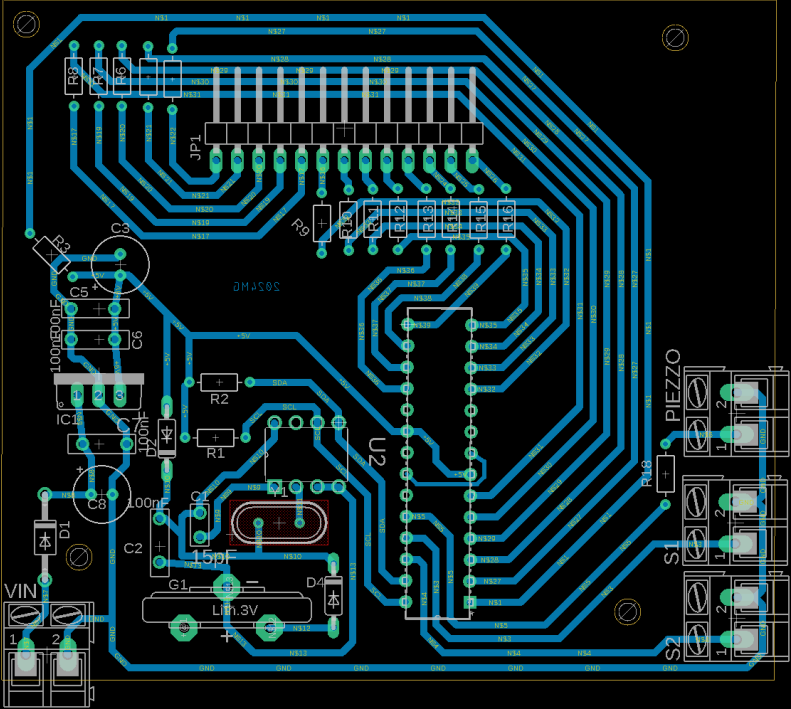

# Projekt z zajęć projektowych z przedmiotu "Projektowanie i Montaż elektroniki"  
Jest to projekt płytki PCB wykonany na potrzeby zajęć projektowych z przedmiotu "Projektowanie i Montaż Elektroniki"  
Zajęcia te polegały na zaprojektowaniu prostej pływki PCB, a następnie samodzielnym jej wytrawieniu.  
Zgodnie z zaleceniami prowadzącego projekt ten bazuje na podstawie jednego z kit-ów dostępnym w sklepie AVT.  
Jest to układ zegara z wyświetlaczem siedmiosegmentowym. Płytka ta wykorzystuje ukłąd scalony PCF8583 który odpowiada za funkcje zegara. Oraz mikrokontroler Atmega8, który odpowiada za obsługe wyświetlacza siedmiosegmentowego.  
Rónież zgodnie z jednym z wymogów prowadzącego, oba schematy wykonane zostały w Autodesk Eagle.  

  
Zdjęcie gotowego, zlutowanego układu.  

